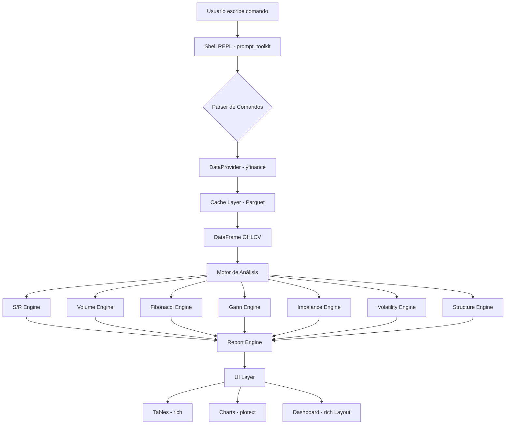

# 📊 Sistema de Análisis Financiero Terminal

[](https://www.python.org/)
[](LICENSE)
[](https://github.com/ranaroussi/yfinance)
[](#)

Un sistema interactivo profesional de línea de comandos (CLI) escrito en Python para el análisis técnico cuantitativo y la gestión de riesgo multi-activo. El sistema recopila datos históricos en tiempo real desde **Yahoo Finance** y los procesa a través de 8 motores de análisis cuantitativo y conceptual (SMC / Smart Money Concepts).

---

## 📌 Tabla de Contenidos
1. [Características Clave](#-características-clave)
2. [Arquitectura del Sistema](#%EF%B8%8F-arquitectura-del-sistema)
3. [Instalación y Configuración](#%EF%B8%8F-instalación-y-configuración)
   - [Requisitos Previos](#requisitos-previos)
   - [Instalación en Linux / macOS](#instalación-en-linux--macos)
   - [Instalación en Windows](#instalación-en-windows)
4. [Guía de Uso Rápido](#-guía-de-uso-rápido)
5. [Comandos del Shell REPL](#-comandos-del-shell-repl)
6. [Estructura del Proyecto](#%EF%B8%8F-estructura-del-proyecto)
7. [Licencia](#-licencia)

---

## 🚀 Características Clave

* **8 Motores de Análisis Integrados**:
  1. **Soportes y Resistencias (S/R)**: Puntos Pivote (Classic, Fibonacci, Camarilla, Woodie, DeMark), fractales de Williams y clustering cuantitativo.
  2. **Volume Profile (VPVR/VPSV)**: POC (Point of Control), VAH (Value Area High), VAL (Value Area Low) y VWAP acumulado con desviaciones.
  3. **Fibonacci**: Retrocesos y extensiones con cálculo automático de zonas de confluencia dorada.
  4. **Ángulos de Gann**: Abanico completo de 9 ángulos y niveles del Cuadrado de 9.
  5. **Imbalance / SMC**: Fair Value Gaps (FVG) alcistas/bajistas, Order Blocks institucionales y Liquidity Pools.
  6. **Volatilidad**: Cálculo dinámico de volatilidad (ATR, Bollinger, Keltner) y percentiles históricos.
  7. **Estructura de Mercado**: Detección de BOS (Break of Structure) y CHoCH (Change of Character).
  8. **Indicadores Clásicos**: RSI, MACD, Oscilador Estocástico y ADX con filtros de fuerza.
* **Motor de Señales y Gestión de Riesgo**: Algoritmo de scoring que consolida confluencias, determinando setups precisos (precio de entrada, SL y TP dinámicos por ATR, tamaño de posición y valor nominal).
* **UI Terminal Premium**: Gráficos de velas (candlesticks) con layout dual [Candlestick | Volumen] + EMAs superpuestas, indicadores de línea (RSI, MACD) y dashboards consolidados multi-panel usando `rich` y `plotext`.
* **Caché Inteligente Parquet**: Optimización de descargas con almacenamiento local temporal de datos.

---

## 🏗️ Arquitectura del Sistema

El sistema sigue un flujo desacoplado, modular y sin estado por activo para facilitar la extensibilidad y robustez matemática:



---

## 🛠️ Instalación y Configuración

### Requisitos Previos
* **Python 3.10** o superior instalado en el sistema.

### Instalación en Linux / macOS
1. Abre tu terminal en el directorio del proyecto.
2. Da permisos de ejecución al script de configuración automática y ejecútalo:
   ```bash
   chmod +x setup_env.sh
   ./setup_env.sh
   ```
3. Activa el entorno virtual:
   ```bash
   source .venv/bin/activate
   ```
4. Ejecuta el sistema:
   ```bash
   python main.py
   ```

### Instalación en Windows
1. Abre la Consola de Comandos (CMD) o PowerShell en el directorio del proyecto.
2. Ejecuta el script de configuración automática:
   ```cmd
   setup_env.bat
   ```
3. Activa el entorno virtual:
   ```cmd
   .venv\Scripts\activate.bat
   ```
4. Ejecuta el sistema:
   ```cmd
   python main.py
   ```

---

## 📖 Guía de Uso Rápido

Al iniciar el shell interactivo `AnalisisActivos`, se cargará el activo por defecto configurado (`BTC-USD` en diario). Puedes interactuar escribiendo comandos directamente:

1. **Cambiar de activo y timeframe**:
   ```
   AnalisisActivos@BTC-USD:1d > set symbol AAPL
   AnalisisActivos@AAPL:1d > set timeframe 4h
   ```
2. **Generar un gráfico técnico de velas**:
   ```
   AnalisisActivos@AAPL:4h > chart candles
   ```
3. **Ejecutar el Dashboard consolidado**:
   ```
   AnalisisActivos@AAPL:4h > dashboard
   ```
4. **Ver reporte cuantitativo completo**:
   ```
   AnalisisActivos@AAPL:4h > report
   ```

---

## 💻 Comandos del Shell REPL

| Comando | Descripción |
|---|---|
| `help` | Muestra la ayuda general y lista de comandos. |
| `set symbol <TICKER>` | Cambia el activo actual y descarga los datos. |
| `set timeframe <TF>` | Cambia el timeframe (`1m`, `5m`, `15m`, `30m`, `1h`, `4h`, `1d`, `1wk`, `1mo`). |
| `set period <PER>` | Rango histórico de datos (`1d`, `1mo`, `1y`, `max`, etc.). |
| `fetch` | Fuerza la recarga de datos históricos desde Yahoo Finance. |
| `analyze <motor>` | Analiza un motor: `sr`, `volume`, `fib`, `gann`, `imbalance`, `volatility`, `structure`, `all`. |
| `indicator <ind>` | Calcula un indicador: `rsi`, `macd`, `stoch`, `adx`, `all`. |
| `chart candles` | **[Layout dual]** Velas japonesas + panel de volumen + EMAs (9/21/50) superpuestas. |
| `chart rsi` | Gráfico de línea del RSI(14) con zonas de sobrecompra/sobreventa. |
| `chart macd` | Gráfico MACD + línea de señal en la terminal. |
| `dashboard` | Abre el Dashboard interactivo multi-panel (pantalla completa). |
| `report` | Genera y muestra un informe detallado con tablas. |
| `compare <T1> <T2>...` | Compara rendimiento y volatilidad de múltiples activos. |
| `watchlist add <T>` | Agrega un activo a la lista de seguimiento. |
| `watchlist scan` | Escanea el rendimiento general de los activos en la watchlist. |
| `config show` | Muestra los parámetros de configuración TOML actuales. |
| `cache clear` | Limpia los datos locales de caché para forzar nuevas descargas. |
| `export csv` | Exporta los datos históricos a un archivo CSV en la carpeta `/exports`. |

---

## 🗂️ Estructura del Proyecto

```
Analisis_Activos/
├── main.py                    # Punto de entrada y diagnóstico de dependencias
├── config.toml                # Archivo de configuración global parametrizable
├── requirements.txt           # Dependencias de librerías del sistema
├── setup_env.sh               # Script Bash de automatización (Unix)
├── setup_env.bat              # Script Batch de automatización (Windows)
├── .gitignore                 # Filtros de exclusión para Git
├── LICENSE                    # Licencia de código abierto MIT
├── README.md                  # Esta documentación
│
├── core/                      # Módulos núcleo del sistema
│   ├── config.py              # Administrador de configuraciones en caliente
│   ├── data_provider.py       # Descargador e integrador con caché Parquet
│   └── session.py             # Almacén del estado de la sesión activa
│
├── analysis/                  # Motores de análisis matemático y SMC
│   ├── support_resistance.py  # Pivots clásicos, fractales y zonas clusterizadas
│   ├── volume_analysis.py     # Volume Profile (VPVR), VWAP, OBV y absorciones
│   ├── fibonacci.py           # Retrocesos, extensiones y zonas de confluencia
│   ├── gann.py                # Abanico de Gann y niveles del Cuadrado de 9
│   ├── imbalance.py           # Fair Value Gaps (FVG) y Order Blocks
│   ├── volatility.py          # ATR, bandas de volatilidad y stops dinámicos
│   ├── indicators.py          # Indicadores clásicos: RSI, MACD, Estocástico, ADX
│   ├── market_structure.py    # Detector estructural de BOS y CHoCH
│   └── report_engine.py       # Motor de reportes consolidados y scoring de señales
│
├── ui/                        # Interfaz gráfica de terminal (TUI)
│   ├── shell.py               # Shell interactivo REPL con prompt_toolkit
│   ├── charts.py              # Graficador de velas plotext
│   ├── tables.py              # Diseñador de tablas estructuradas Rich
│   ├── dashboard.py           # Layout y lógica de la vista multi-panel
│   ├── colors.py              # Estilos ANSI y paletas de colores
│   └── formatters.py          # Formateadores numéricos de precisión
│
└── utils/                     # Utilidades generales
    ├── validators.py          # Validación de entradas y tipos del usuario
    └── logger.py              # Sistema de logs a archivo para diagnóstico
```

---

## 📄 Licencia

Este proyecto está bajo la licencia MIT. Consulta el archivo [LICENSE](LICENSE) para obtener más información.
